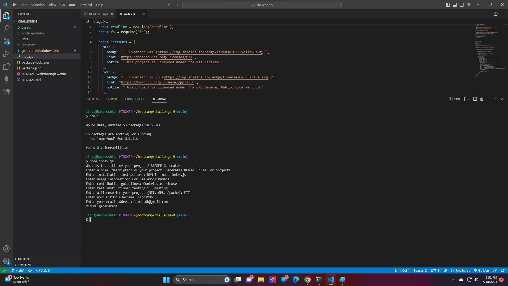
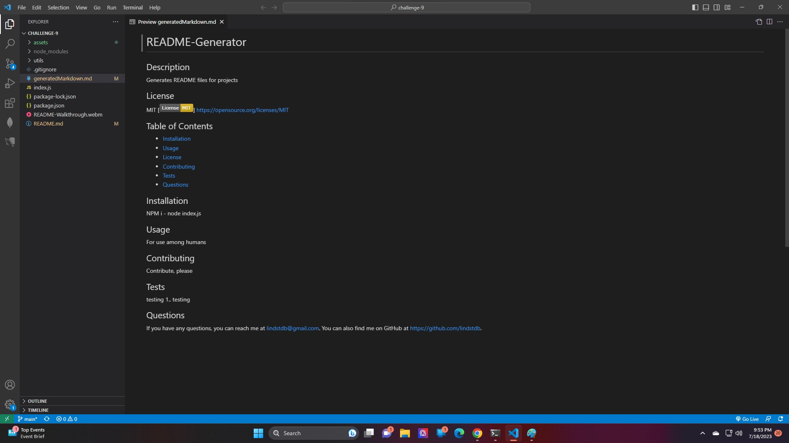

# README Generator

## Description
Generates a professional readme.md using node prompts.

## Table of Contents
- [Installation](#installation)
- [Usage](#usage)

## Installation
Install [Inquirer package](https://www.npmjs.com/package/inquirer/v/8.2.4) and open index.js in an intergrated terminal in VS code. Run the program with 'node index.js' on the command line.

## Usage
Walk-through Video: https://drive.google.com/file/d/1-eVELE316r6Z8UkXfCaAKRwwZ4n5VJuF/view

